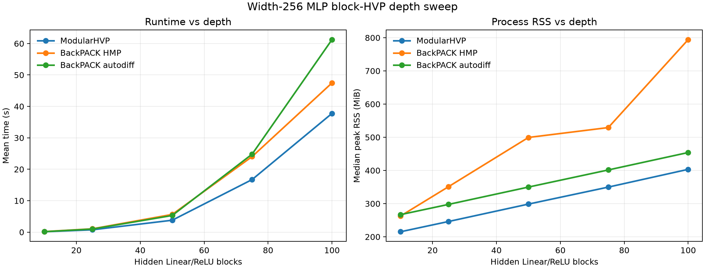

# ModularHVP

ModularHVP is an eager PyTorch-compatible runtime for computing block-scoped
Hessian-vector products during ordinary backward execution.

The target public API is:

```python
from modular_hvp import modular_hvp

with modular_hvp(model, v):
    out = model(x)
    loss = criterion(out, y)
    loss.backward()

for name, p in model.named_parameters():
    p.grad
    p.hvp
```

Current implementation status:

- The default `modular_hvp(...)` context computes per-parameter block HVPs for
  Linear/ReLU MLPs with MSE loss using local dual activations.
- The primitive `DualTensor` backend implements the operator-overloading layer
  used by lower-level forward-mode tests and by the current local backward
  tensor programs.
- `DualTensor.primal` preserves ordinary PyTorch autograd graph construction.
  `DualTensor.tangent` is detached at construction and every primitive tangent
  rule runs as a no-grad side channel using detached primal values.
- The runtime keeps the user-visible forward path ordinary. Internally, it uses
  a keyed side-channel of `DualTensor` tangents: each parameter block has its
  own key, keys are never summed into a global tangent, and only primal tensors
  are returned to user code.
- During backward, tensor hooks at saved activation boundaries consume the
  keyed side-channel as PyTorch's ordinary backward reaches that block. HVPs are
  written into the single public `p.hvp` field during that same backward pass.
- The generic hook-plumbing runtime remains available as an internal extension
  point for future optimized dualized-backward integration.

The primitive dual-tensor backend is available independently for forward-mode
operator tests:

```python
from modular_hvp import make_dual, primal, tangent

x_hat = make_dual(x, x_dot)
y_hat = torch.relu(x_hat @ weight)

primal(y_hat)
tangent(y_hat)
```

This layer overloads selected ATen primitives and raises `NotImplementedError`
when a `DualTensor` reaches an unsupported operation.

## Toy MLP Comparison

The BackPACK comparison script checks the public `modular_hvp(...)` interface
against BackPACK HMP and BackPACK's reverse-over-reverse HVP utility. It also
reports a standard PyTorch `loss.backward()` pass as a first-order baseline:

```bash
uv run python benchmarks/compare_toy_mlp.py
```

The script reports max absolute/relative HVP error against `modular_hvp` plus
wall-clock time, sampled per-process RSS, Python allocation peak, and CUDA
allocation peak when running on CUDA. The `torch_backward` row is a timing and
memory baseline only; it computes ordinary gradients, not HVPs.

For fair absolute RSS measurement, each method is benchmarked in its own spawned
process. Method-specific setup and imports happen before warmup/measurement, so
RSS includes the method's process footprint while timing focuses on the measured
forward/backward/HVP computation. Returned HVP or gradient tensors are kept
alive until the RSS sampler exits, so methods are not credited for immediately
dropping their outputs.

RSS is a coarse process-level measurement, so tiny toy runs can be noisy; deeper
stress settings make the memory differences more visible. The table reports
median average RSS, median peak RSS, and max peak RSS across measured repeats.

Recorded CPU runs:

| Setting | Command | Shape |
| --- | --- | --- |
| Toy 4-layer MLP | `uv run python benchmarks/compare_toy_mlp.py --batch-size 512 --d-in 784 --d-hidden 512 --hidden-layers 4 --d-out 10 --dtype float32 --warmup 2 --repeats 8` | batch 512, input 784, hidden width 512, 4 hidden Linear/ReLU blocks, output 10, float32 |
| Deep stress 50-layer MLP | `uv run python benchmarks/compare_toy_mlp.py --batch-size 256 --d-in 784 --d-hidden 512 --hidden-layers 50 --d-out 10 --dtype float32 --warmup 1 --repeats 3` | batch 256, input 784, hidden width 512, 50 hidden Linear/ReLU blocks, output 10, float32 |

Latest local results:

For `backpack_hmp`, BackPACK's `extend(...)` setup is performed before the
timed region. The measured region contains the forward pass, BackPACK HMP
backward pass, and one `param.hmp(...)` application per parameter.

The current `modular_hvp` implementation is correct on these MLP benchmarks,
and follows the block-scoped invariant: each parameter tangent is keyed to its
own parameter block, never summed with neighboring blocks, and contributes only
to that parameter's public `p.hvp`. Reused parameters accumulate into that same
`p.hvp`; the current shared-parameter path uses a correctness fallback.

The local runtime does not compute a full HVP and slice it. It uses a
block-keyed side-channel so different parameter epsilons can pass through the
same primitive tensor program without being combined into one model-wide
tangent.

The forward side does not reimplement module math and does not replay once per
parameter. For an active owning module, the runtime calls the module's original
`forward` once with local `DualTensor` parameters. PyTorch decomposes that code
to ATen as usual; the `DualTensor` backend only changes behavior when an ATen
primitive receives a dual input. The resulting tangent payload is keyed by
parameter, so `dy_weight` and `dy_bias` remain separate local epsilons instead
of being summed into a global tangent.

The current backward side is still the narrow MLP/MSE milestone, not the final
general backward-hook runtime. It no longer runs repeated per-parameter suffix
applications from the loss hook. Instead, the loss hook initializes the
model-output curvature side-channel, and activation hooks consume and propagate
that side-channel as ordinary PyTorch backward reaches each block. The tensor
programs are expressed through ATen primitives and run through the `DualTensor`
registry:

- Linear backward-side pieces use `aten.mm`, `aten.t`, and `aten.sum`.
- ReLU dispatches as `aten.relu.default`; its backward-side program uses
  `aten.threshold_backward.default`.
- MSE loss dispatches as ordinary PyTorch `mse_loss`; the local runtime only
  uses the scalar Hessian scale at the model-output boundary for reductions
  `mean` and `sum`.

The backend has explicit graph-isolation tests: primal outputs keep
`requires_grad` and `grad_fn`, while tangent outputs have
`requires_grad == False` and `grad_fn is None`, even when the input tangent was
created with `requires_grad=True`.

| Setting | Method | Max abs error | Max rel error | Mean time | Median avg RSS | Median peak RSS | Max peak RSS |
| --- | --- | ---: | ---: | ---: | ---: | ---: | ---: |
| Toy 4-layer | `modular_hvp` | 0.000e+00 | 0.000e+00 | 76.394 ms | 196.99 MiB | 205.00 MiB | 205.27 MiB |
| Toy 4-layer | `backpack_hmp` | 3.725e-09 | 4.425e-07 | 83.965 ms | 357.43 MiB | 366.50 MiB | 460.75 MiB |
| Toy 4-layer | `backpack_autodiff` | 3.725e-09 | 3.035e-07 | 95.043 ms | 248.92 MiB | 256.76 MiB | 256.97 MiB |
| Toy 4-layer | `torch_backward` | n/a | n/a | 12.249 ms | 182.17 MiB | 182.19 MiB | 182.26 MiB |
| Deep stress 50-layer | `modular_hvp` | 0.000e+00 | 0.000e+00 | 13003.740 ms | 401.54 MiB | 431.33 MiB | 431.98 MiB |
| Deep stress 50-layer | `backpack_hmp` | 7.451e-09 | 1.206e-06 | 14258.464 ms | 906.65 MiB | 936.36 MiB | 1.11 GiB |
| Deep stress 50-layer | `backpack_autodiff` | 7.451e-09 | 7.954e-07 | 14908.764 ms | 433.74 MiB | 478.16 MiB | 478.46 MiB |
| Deep stress 50-layer | `torch_backward` | n/a | n/a | 97.658 ms | 302.61 MiB | 327.02 MiB | 327.31 MiB |

## Depth Sweep

The depth sweep fixes width at 256 and compares the three HVP methods across
10, 25, 50, 75, and 100 hidden Linear/ReLU blocks:

```bash
uv run python benchmarks/depth_sweep_mlp.py \
  --depths 10 25 50 75 100 \
  --batch-size 256 --d-in 784 --d-hidden 256 --d-out 10 \
  --dtype float32 --warmup 1 --repeats 3
```

The script writes the raw data to
`benchmarks/results/depth_sweep_width256.json` and the trend figure to
`benchmarks/results/depth_sweep_width256.png`.



| Depth | Method | Max abs error | Max rel error | Mean time | Median avg RSS | Median peak RSS |
| ---: | --- | ---: | ---: | ---: | ---: | ---: |
| 10 | `modular_hvp` | 0.000e+00 | 0.000e+00 | 0.122 s | 210.91 MiB | 215.27 MiB |
| 10 | `backpack_hmp` | 3.725e-09 | 7.478e-07 | 0.172 s | 256.96 MiB | 262.74 MiB |
| 10 | `backpack_autodiff` | 3.725e-09 | 8.012e-07 | 0.149 s | 258.97 MiB | 266.88 MiB |
| 25 | `modular_hvp` | 0.000e+00 | 0.000e+00 | 0.743 s | 233.85 MiB | 246.14 MiB |
| 25 | `backpack_hmp` | 1.490e-08 | 1.122e-06 | 1.053 s | 337.60 MiB | 351.11 MiB |
| 25 | `backpack_autodiff` | 1.490e-08 | 1.122e-06 | 0.987 s | 279.00 MiB | 297.67 MiB |
| 50 | `modular_hvp` | 0.000e+00 | 0.000e+00 | 3.786 s | 275.30 MiB | 298.59 MiB |
| 50 | `backpack_hmp` | 1.490e-08 | 8.969e-07 | 5.628 s | 477.61 MiB | 499.40 MiB |
| 50 | `backpack_autodiff` | 1.490e-08 | 8.969e-07 | 5.295 s | 320.11 MiB | 349.87 MiB |
| 75 | `modular_hvp` | 0.000e+00 | 0.000e+00 | 16.721 s | 319.03 MiB | 349.80 MiB |
| 75 | `backpack_hmp` | 5.588e-09 | 1.006e-06 | 24.026 s | 445.45 MiB | 529.23 MiB |
| 75 | `backpack_autodiff` | 5.588e-09 | 1.006e-06 | 24.802 s | 364.70 MiB | 401.50 MiB |
| 100 | `modular_hvp` | 0.000e+00 | 0.000e+00 | 37.764 s | 365.11 MiB | 403.32 MiB |
| 100 | `backpack_hmp` | 2.980e-08 | 9.094e-07 | 47.471 s | 750.78 MiB | 794.26 MiB |
| 100 | `backpack_autodiff` | 2.980e-08 | 9.094e-07 | 61.244 s | 393.50 MiB | 454.02 MiB |
